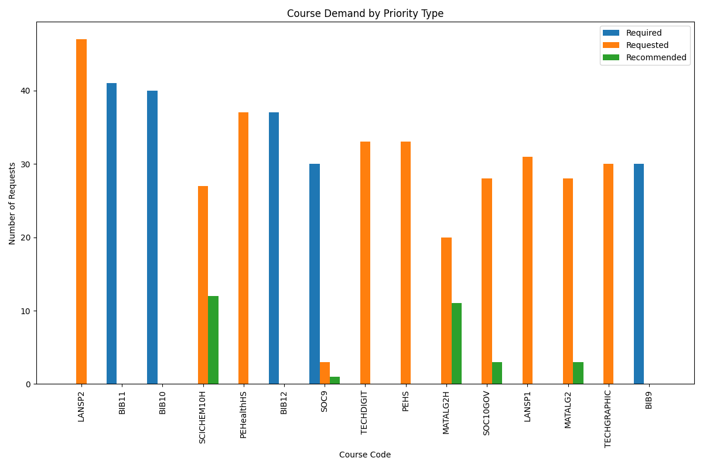
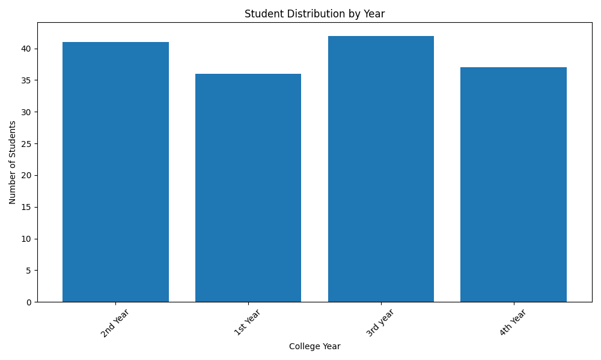

# Crestwood College Course Scheduling Analysis Report

## Data Summary

- Number of Students: 156
- Number of Courses: 75
- Number of Lecturers: 31
- Number of Rooms: 29

## Data Validation

Valid data: Yes

## Data Insights

- Top 10 most requested courses: LANSP2, BIB11, BIB10, SCICHEM10H, PEHealthHS, BIB12, SOC9, TECHDIGIT, PEHS, MATALG2H
- Request priorities: 178 required, 963 requested, 118 recommended
- Average courses requested per student: 8.07

## Course Demand Analysis

### Top 10 Most Requested Courses

| Course Code | Course Title | Required | Requested | Recommended | Total |
|------------|--------------|----------|-----------|-------------|-------|
| LANSP2 | Spanish II | 0 | 47 | 0 | 47 |
| BIB11 | Bible 11 | 41 | 0 | 0 | 41 |
| BIB10 | Bible 10 | 40 | 0 | 0 | 40 |
| SCICHEM10H | Chemistry Honors | 0 | 27 | 12 | 39 |
| PEHealthHS | Health - High  | 0 | 37 | 0 | 37 |
| BIB12 | Bible 12 | 37 | 0 | 0 | 37 |
| SOC9 | US History | 30 | 3 | 1 | 34 |
| TECHDIGIT | Digital Imaging & Editing | 0 | 33 | 0 | 33 |
| PEHS | Physical Education - High  | 0 | 33 | 0 | 33 |
| MATALG2H | Alg II Honors | 0 | 20 | 11 | 31 |

## Potential Scheduling Conflicts

- Course LANSP2 has demand of 47 but capacity of only 40
- Course BIB11 has demand of 41 but capacity of only 40

## Visualizations

### Course Demand by Priority

### Student Distribution by Year

