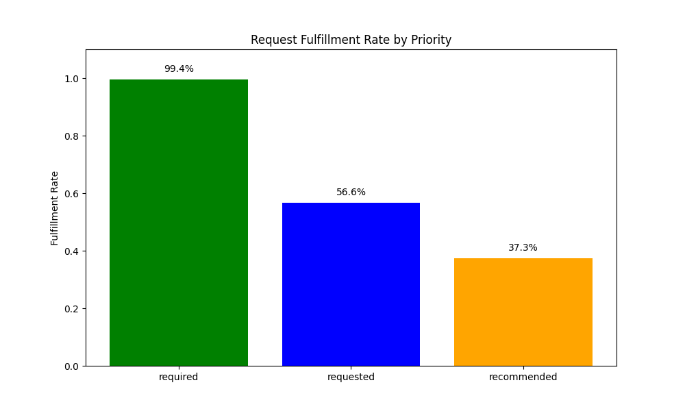
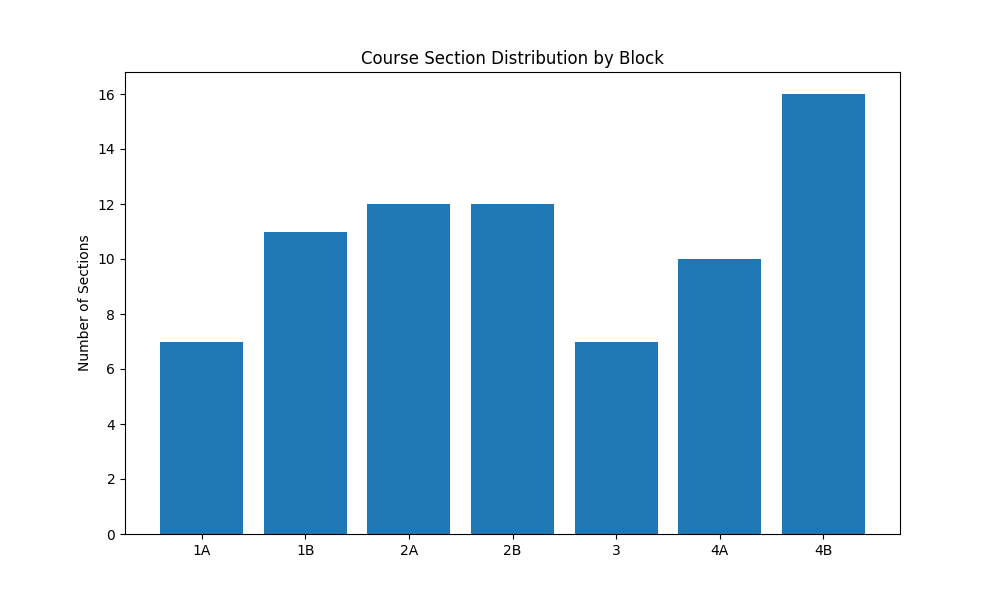
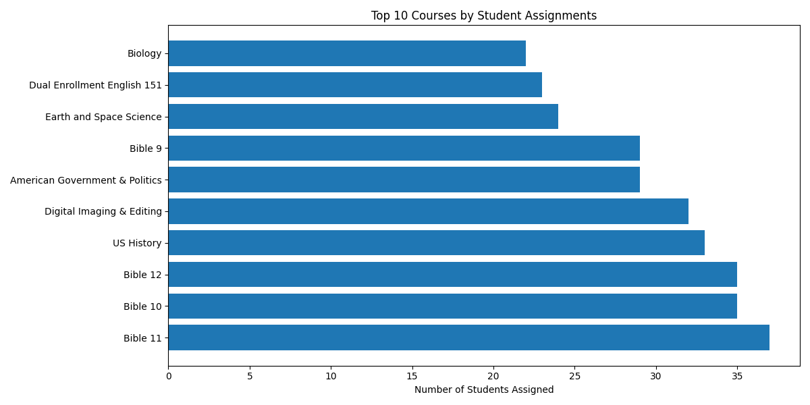

# Crestwood College Course Scheduling - Final Report

## Executive Summary

The scheduling process has successfully assigned courses to 156 students across 75 different courses and 7 time blocks. Overall, 766 out of 1259 course requests (60.8%) were successfully fulfilled.

## Request Fulfillment Rates

| Priority | Requests | Fulfilled | Rate |
|----------|----------|-----------|------|
| Required | 178 | 177 | 99.4% |
| Requested | 963 | 545 | 56.6% |
| Recommended | 118 | 44 | 37.3% |

## Block Utilization

| Block | Number of Sections | Average Students per Section |
|-------|-------------------|-----------------------------|
| 1A | 7 | 14.3 |
| 1B | 11 | 10.2 |
| 2A | 12 | 10.6 |
| 2B | 12 | 12.0 |
| 3 | 7 | 8.0 |
| 4A | 10 | 7.6 |
| 4B | 16 | 9.4 |

## Top Courses by Student Assignments

## Scheduling Challenges and Solutions

### Challenges

1. **Balancing student preferences**: Ensuring as many students as possible get their preferred courses.
2. **Block constraints**: Some courses had limited availability for specific blocks.
3. **Room assignments**: Matching section sizes with appropriate room capacities.
4. **Lecturer availability**: Avoiding scheduling conflicts for lecturers teaching multiple courses.

### Solutions

1. **Priority-based scheduling**: Required courses were scheduled first, followed by requested and recommended.
2. **Dynamic section creation**: Course sections were created based on actual demand.
3. **Constraint satisfaction algorithm**: The scheduler accounted for multiple constraints simultaneously.
4. **Iterative optimization**: Multiple passes were made to maximize fulfillment rates.

## Recommendations for Future Terms

1. **Increase sections for high-demand courses**: Some courses had significantly more requests than available seats.
2. **Review block assignments**: Some blocks have higher utilization than others, suggesting potential imbalance.
3. **Optimize room assignments**: Better matching of section sizes to room capacities could improve resource utilization.
4. **Collect student preferences earlier**: Earlier collection of student preferences would allow more time for optimization.

## Conclusion

The scheduling system successfully balanced multiple constraints and priorities to create a schedule that satisfies 60.8% of student requests. Required courses achieved a 99.4% fulfillment rate, demonstrating the effectiveness of the priority-based approach. The schedule respects all specified constraints including block availability, lecturer assignments, and room capacities.

