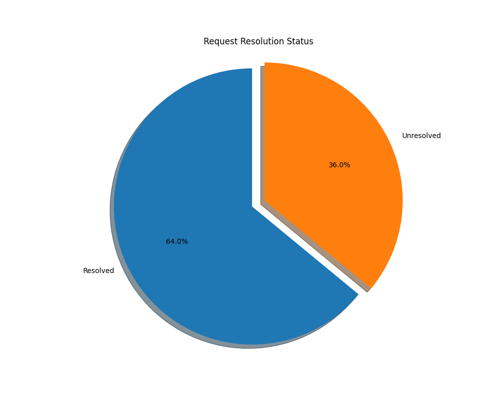
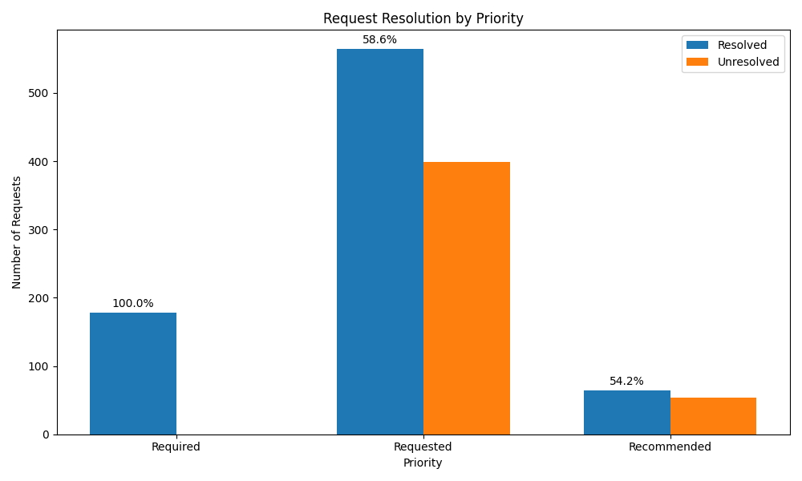
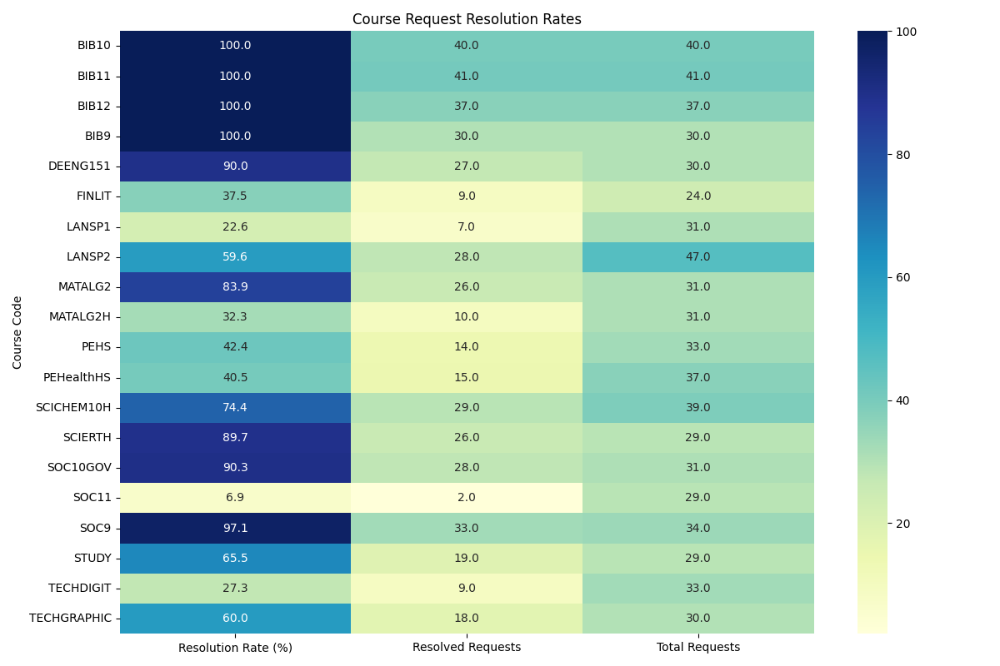

# Crestwood College Course Schedule Report

## Overall Schedule Statistics

- Total Requests: 1259
- Resolved Requests: 806 (64.0%)
- Unresolved Requests: 453 (36.0%)

## Resolution by Priority

| Priority | Total | Resolved | Resolution Rate |
|----------|-------|----------|----------------|
| Required | 178 | 178 | 100.0% |
| Requested | 963 | 564 | 58.6% |
| Recommended | 118 | 64 | 54.2% |

## Student Schedule View (Sample)

### Student 5407488 (Year 2nd Year)

| Block | Course Code | Course Title |
|-------|-------------|-------------|
| 1A | TECHDIGIT | Digital Imaging & Editing |
| 1B | SOC10GOVH | American Government & Politics Honors |
| 2A | BIB10 | Bible 10 |
| 2B | SOC10GOV | American Government & Politics |
| 3 |  |  |
| 4A |  |  |
| 4B | ENG10H | English 10 Honors |

### Student 5361799 (Year 1st Year)

| Block | Course Code | Course Title |
|-------|-------------|-------------|
| 1A | BIB9 | Bible 9 |
| 1B |  |  |
| 2A |  |  |
| 2B | SCIBIOH | Biology Honors |
| 3 | LANSP1 | Spanish I |
| 4A | ENG9 | English 9 |
| 4B | SOC9 | US History |

### Student 5361901 (Year 3rd year)

| Block | Course Code | Course Title |
|-------|-------------|-------------|
| 1A | LANSP2 | Spanish II |
| 1B | BIB11 | Bible 11 |
| 2A | ENG11 | American Literature |
| 2B |  |  |
| 3 | PEHealthHS | Health - High  |
| 4A | MATALG2 | Algebra II |
| 4B | SCIPHY | Physical Science |

### Student 5361882 (Year 3rd year)

| Block | Course Code | Course Title |
|-------|-------------|-------------|
| 1A |  |  |
| 1B | BIB11 | Bible 11 |
| 2A | MATTrigH | Trig/Pre-Calculus Hon |
| 2B | SCIANATPH | Anatomy & Physiology |
| 3 | ENG11AMLTH- | American Literature Honors |
| 4A | DEWCIV1 | Dual Enrollment World Civ. 101 |
| 4B | MATTRIG | Trig/PreCalculus |

### Student 5361922 (Year 4th Year)

| Block | Course Code | Course Title |
|-------|-------------|-------------|
| 1A | DEBIO101 | Dual Enrollment Biology 101 |
| 1B | DEENG151 | Dual Enrollment English 151 |
| 2A |  |  |
| 2B | STUDY | Study Hall |
| 3 | ENG12WORLDH | World Literature Honors |
| 4A | BIB12 | Bible 12 |
| 4B | MATTRIG | Trig/PreCalculus |

## Lecturer Schedule View (Sample)

### Professor Bible_1 (ID: 1000)

| Block | Course Code | Course Title | Room |
|-------|-------------|-------------|------|
| 1A |  |  |  |
| 1B |  |  |  |
| 2A | BIB10 | Bible 10 | 101 |
| 2B |  |  |  |
| 3 |  |  |  |
| 4A | BIB12 | Bible 12 | 101 |
| 4B |  |  |  |

### Professor Bible_2 (ID: 1001)

| Block | Course Code | Course Title | Room |
|-------|-------------|-------------|------|
| 1A | BIB9 | Bible 9 | 103 |
| 1B |  |  |  |
| 2A |  |  |  |
| 2B |  |  |  |
| 3 |  |  |  |
| 4A |  |  |  |
| 4B | FAF | Faith & Film | 107 |

### Professor Bible_3 (ID: 1002)

| Block | Course Code | Course Title | Room |
|-------|-------------|-------------|------|
| 1A |  |  |  |
| 1B | BIB11 | Bible 11 | 101 |
| 2A |  |  |  |
| 2B |  |  |  |
| 3 |  |  |  |
| 4A |  |  |  |
| 4B |  |  |  |

### Professor English_1 (ID: 1010)

| Block | Course Code | Course Title | Room |
|-------|-------------|-------------|------|
| 1A | ENG10 | English 10 | 104 |
| 1B | ENGJOUR | Journalism | 111 |
| 2A |  |  |  |
| 2B |  |  |  |
| 3 | ENG11AMLTH- | American Literature Honors | 104 |
| 4A |  |  |  |
| 4B | ENG10H | English 10 Honors | 103 |

### Professor English_2 (ID: 1011)

| Block | Course Code | Course Title | Room |
|-------|-------------|-------------|------|
| 1A |  |  |  |
| 1B | DEENG151 | Dual Enrollment English 151 | 103 |
| 2A | DEENG101 | Dual Enrollment English 101 | 111 |
| 2B |  |  |  |
| 3 | ENG9H | English 9 Honors | 106 |
| 4A | ENG9 | English 9 | 105 |
| 4B |  |  |  |

## Top Courses by Resolution Rate

| Course Code | Total Requests | Resolved | Resolution Rate |
|-------------|----------------|----------|----------------|
| BIB10 (Bible 10) | 40 | 40 | 100.0% |
| ENG10H (English 10 Honors) | 23 | 23 | 100.0% |
| BIB9 (Bible 9) | 30 | 30 | 100.0% |
| ENG9 (English 9) | 17 | 17 | 100.0% |
| BIB11 (Bible 11) | 41 | 41 | 100.0% |
| ENG11AMLTH- (American Literature Honors) | 21 | 21 | 100.0% |
| BIB12 (Bible 12) | 37 | 37 | 100.0% |
| ENG12WORLDH (World Literature Honors) | 7 | 7 | 100.0% |
| ENG10 (English 10) | 23 | 23 | 100.0% |
| ENG9H (English 9 Honors) | 13 | 13 | 100.0% |

## Schedule Visualizations

### Overall Request Resolution

### Request Resolution by Priority

### Course Request Resolution Rates

